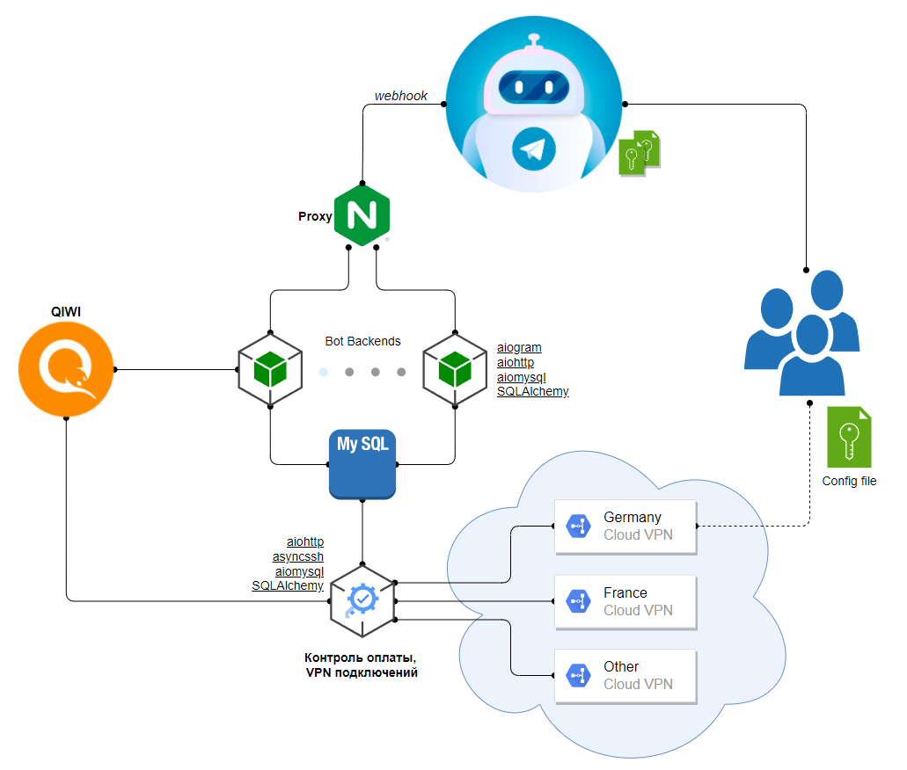

## Axo-VPN / Telegram бот


[](https://github.com/psf/black)

[@axo_vpn_bot](https://t.me/axo_vpn_bot)

Полностью асинхронный бот для покупки VPN через телеграм 

Написан с использованием:
* aiogram
* asyncio
* aiohttp
* asyncssh
* aiomysql
* sqlalchemy




### Для работы необходимо указать следующие переменные окружения

    # for database
    MYSQL_DATABASE = vpn_bot
    MYSQL_HOST = localhost
    MYSQL_LOGIN = root
    MYSQL_PASSWORD = password

    QIWI_TOKEN = aabb...
    TG_BOT_TOKEN = 0011...

    # for webhook
    BASE_URL = https://...
    PUBLIC_IP = 123.123.123.123
    CERTIFICATE_PATH = /absolute/path/to/webhook_cert.pem

## Старт

Настраиваем Nginx:

```nginx configuration
server {
    listen 443 ssl;

    ssl_protocols   TLSv1 TLSv1.1 TLSv1.2;
    server_name     <PUBLIC_IP>;

    ssl on;
    ssl_certificate     /absolute/path/to/webhook_cert.pem;
    ssl_certificate_key /absolute/path/to/webhook_pkey.pem;

    location /webhook/bot {
        include     proxy_params;
        proxy_pass  http://127.0.0.1:8888/webhook/bot;
    }
}
```

Запуск бота:
```shell
python bot.py
```

Запуск менеджера:
```shell
python manager.py
```